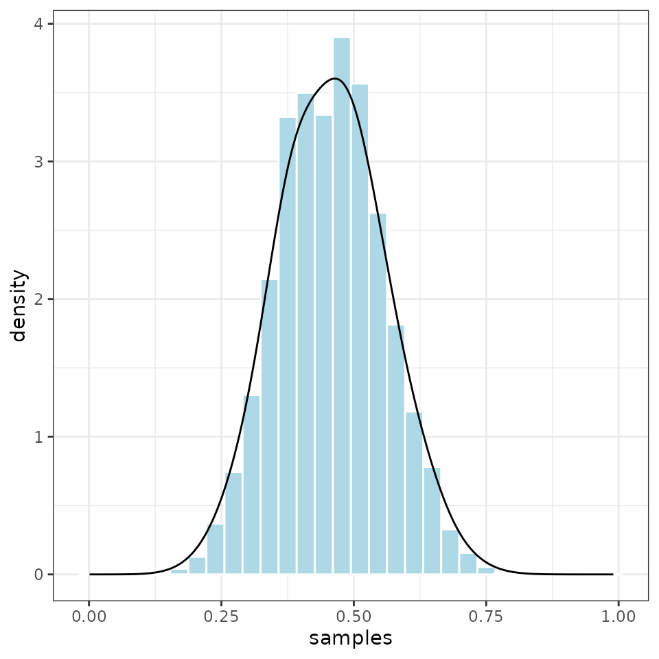

# Coin flipping example

``` r
library(treepplr)
library(dplyr)
library(ggplot2)
```

## Load model and data files

Load the coin model and example data available within *treepplr.*

``` r
model <- tp_model("coin")
data <- tp_data("coin")
```

The data in this example is a sequence of coin flip results. *treeppl*
can only read data in JSON format, that’s why all example data are in
this format.

``` r
str(data)
#> List of 1
#>  $ coinflips: logi [1:20] FALSE TRUE TRUE TRUE FALSE TRUE ...
```

## Run TreePPL

Now we can compile and run the TreePPL program. The function
*tp_treeppl()* has many optional arguments to change the inference
method used. Here, we will use the default settings for inference
methods, run 100 sweeps and 100 particles within each sweep.

``` r
output_list <- tp_treeppl(model = model, data = data, samples = 100, n_runs = 100)
```

## Plot the posterior distribution

Just as we compare different MCMC runs/chains to test for convergence,
in SMC we tun several sweeps and then compare their normalizing
constants to test if they converged to the same posterior distribution.
The criterion for convergence is that the variance of the normalizing
constants across all sweeps is lower than 1.

``` r
tp_smc_convergence(output_list)
#> [1] 0.01126985

output <-  tp_parse(output_list) %>% 
  dplyr::mutate(total_lweight = log_weight + norm_const) %>% 
  dplyr::mutate(norm_weight = exp(total_lweight - max(.$total_lweight)))

ggplot2::ggplot(output, ggplot2::aes(samples, weight = norm_weight)) +
  ggplot2::geom_histogram(ggplot2::aes(y = ggplot2::after_stat(density)),
                 col = "white", fill = "lightblue", binwidth=0.01) +
  ggplot2::geom_density() +
  ggplot2::theme_bw()
```


