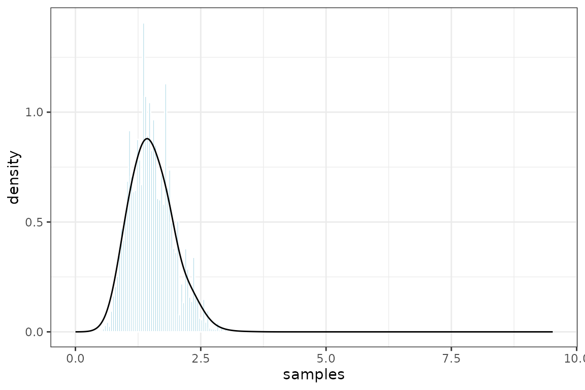

# Constant rate birth (CRB) model

``` r
library(treepplr)
library(ape)
library(ggplot2)
library(magrittr)
```

## Data

We will use an example (random) tree that comes with the package.

``` r
tree <- read.tree(system.file(
  "extdata/crb_tree_15_tips.tre", package = "treepplr"))
plot.phylo(tree, cex = 0.5)
```


We need to convert the tree to a **TreePPL** readable format and read
the CRB model.

``` r
data <- tp_phylo_2_TreePPL(tree, age="down-top")
model <- tp_model(system.file("extdata/crb.tppl", package = "treepplr"))
```

## Run treeppl

Compile and run the TreePPL program with standard inference settings.

``` r
output_list <- tp_treeppl(model = model, data = data)
```

## Plot posterior

TreePPL outputs the log weight of each sample, so first we need to get
the normalized weights and then we can plot the posterior distribution
produced.

``` r
# turn list into a data frame where each row represents one sample 
# and calculate normalized weights from log weights
output <-  tp_parse(output_list) %>% 
  dplyr::mutate(weight = exp(log_weight - max(.$log_weight)))

ggplot(output, aes(samples, weight=weight)) +
  geom_histogram(aes(y = after_stat(density)),
                 col = "white", fill = "lightblue", binwidth=0.04) +
  geom_density() +
  theme_bw()
```


